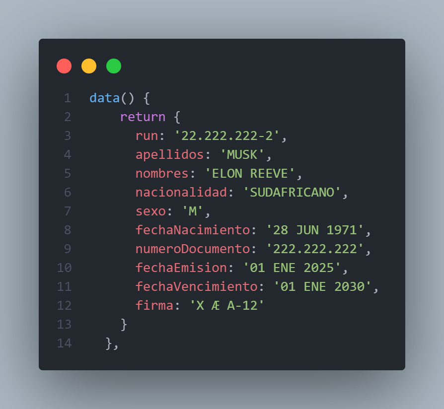

# Introducción a Componentes Web y Vue Js - Nicolás Valderrama

1. Se crea una aplicación Vue Js con Vue CLI.

2. Se crean variables en el estado.

3. Se Interpolan variables del estado en el template.

(Se muestra ejemplo de `Nombres` y `Apellidos`)

